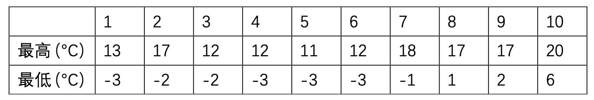
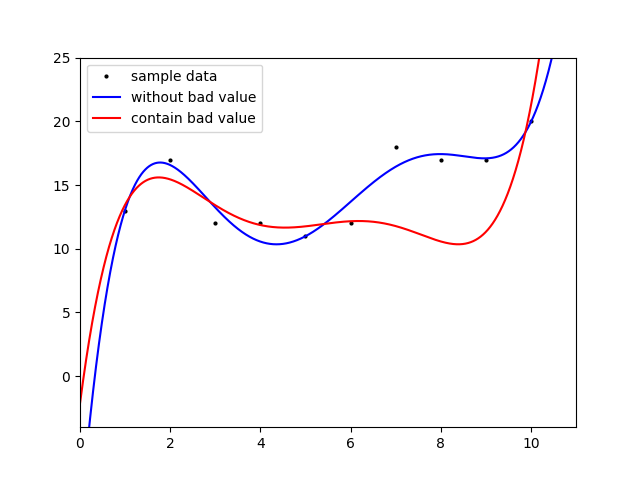

# MC2022Spring-Regression

Homework 2 of MC2022Spring(Media and Cognition 2022 Spring)

## Introduction

- A simple demo of a regression.

- Dataset:

  

## Requirements

```
colorlog==6.6.0
matplotlib==3.5.1
numpy==1.21.5
```

## Run Demo

1. Make sure you have the folder: `'./img/'`
2. Enjoy it!

```
python main.py
```

## Result

Just show one img, more in `./img/`

